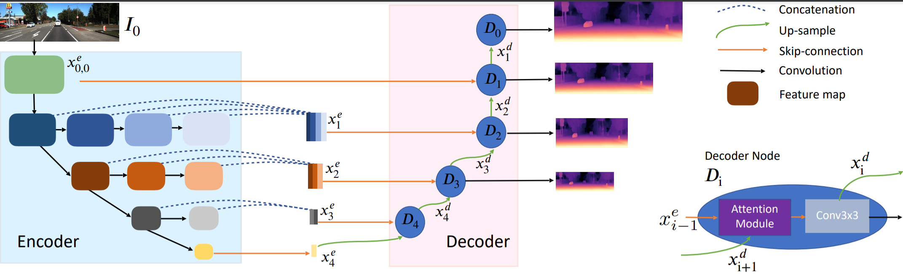

# DIFFNet
 This repo is for [Self-Supervised Monocular DepthEstimation with Internal Feature Fusion](null) The British Machine Vision Conference (BMVC2021)
 A new bockbone for self-supervised depth estimaiton

## *Paper and trained models are coming soon*

####Acknowledgement
 Thanks the authors for their released works:
 [monodepth2](https://github.com/nianticlabs/monodepth2)
 [HRNet](https://github.com/HRNet/HRNet-Semantic-Segmentation)

