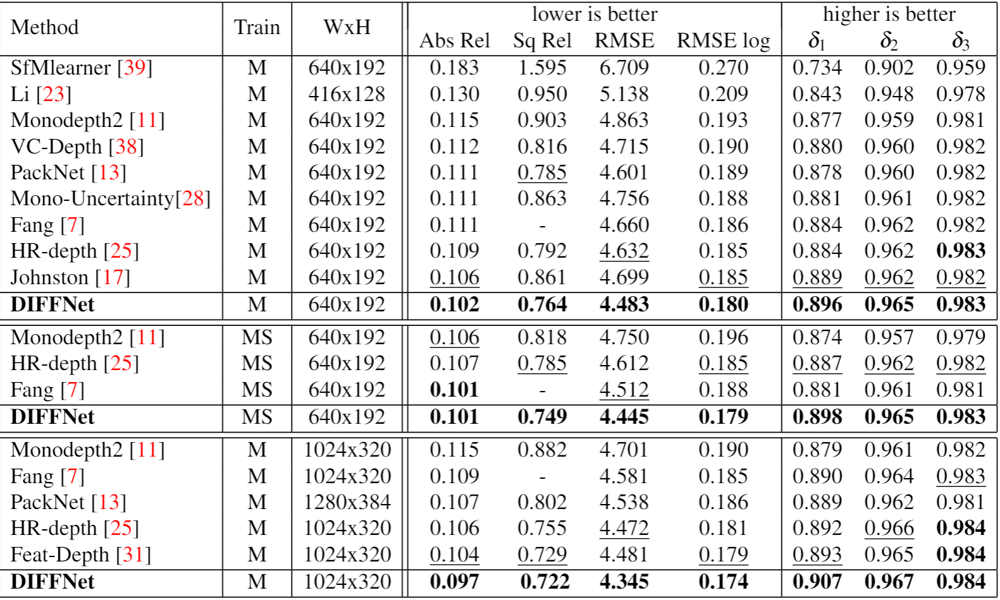
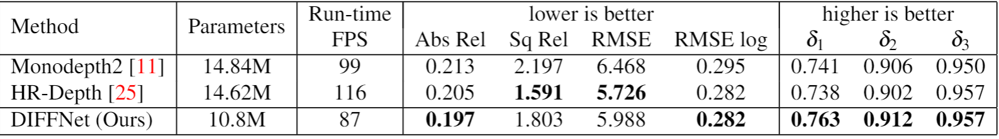

# DIFFNet

This repo is for **[Self-Supervised Monocular Depth Estimation with Internal Feature Fusion(arXiv)](https://arxiv.org/pdf/2110.09482.pdf), BMVC2021**

 A new backbone for self-supervised depth estimation.

[](https://paperswithcode.com/sota/monocular-depth-estimation-on-kitti-eigen-1?p=self-supervised-monocular-depthestimation)
The SOTA model access: [diffnet_1024x320_ms_ttr](https://drive.google.com/file/d/1u4pizvk9xZ8bbyWLyjd0m_9hnm_mO9-Q/view?usp=sharing)


If you think it is not a bad work, please consider citing it.
```
@inproceedings{zhou_diffnet,
    title={Self-Supervised Monocular Depth Estimation with Internal Feature Fusion},
    author={Zhou, Hang and Greenwood, David and Taylor, Sarah},
    booktitle={British Machine Vision Conference (BMVC)},
    year={2021}
    }

```

## Comparing with others


## Evaluation on selected hard cases:


## Trained weights

- [diffnet_1024x320_ms_ttr](https://drive.google.com/file/d/1u4pizvk9xZ8bbyWLyjd0m_9hnm_mO9-Q/view?usp=sharing)
- [diffnet_1024_320_ms](https://drive.google.com/file/d/1VR0BYXKyclvv1Gq2XcQCR-fvJuFQ80SI/view?usp=sharing)
- [diffnet_640x192](https://drive.google.com/file/d/1ZQPZWsIy_KyjV-Et6FSCOPM4iATjDPn-/view?usp=sharing)
- [diffnet_640x192_ms](https://drive.google.com/file/d/1_vh1F_cabTlEjBGXkHZOpAB1CMLmosxg/view?usp=sharing)
- [diffnet_1024x320](https://drive.google.com/file/d/1SuyBMS3ZLYuZwgyGSpmNrag7ESjRUC52/view?usp=sharing)
- [diffnet_1024x320_ttr](https://drive.google.com/file/d/1R0b0GYUxyZeaVCHQEELHevHoegwFi3qU/view?usp=sharing)

## Setting up before training and testing

- Data preparation: please refer to [monodepth2](https://github.com/nianticlabs/monodepth2)

## Training:

```
sh start2train.sh
```

* Note:

## Testing:

```
sh disp_evaluation.sh
```
## Infer a single depth map from a RGB:

```
sh test_sample.sh
```


#### Acknowledgement
 Thanks the authors for their works:
 - [monodepth2](https://github.com/nianticlabs/monodepth2)
 - [HRNet](https://github.com/HRNet/HRNet-Semantic-Segmentation)

