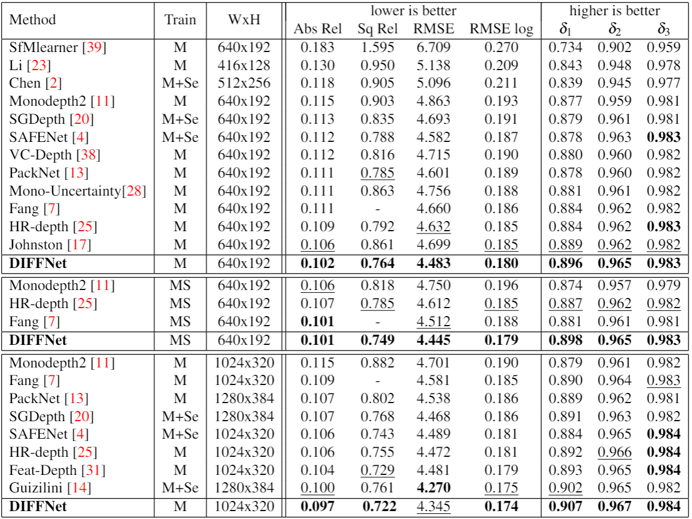

# DIFFNet


This repo is for **[Self-Supervised Monocular DepthEstimation with Internal Feature Fusion(arXiv)](https://arxiv.org/pdf/2110.09482.pdf), BMVC2021**

 A new bockbone for self-supervised depth estimaiton.

If you think it is not a bad work, please consider citing it.

```
@article{diffnet_bmvc,
    title = {Self-Supervised Monocular DepthEstimation with Internal Feature Fusion},
    author  = { Hang Zhou, David Greenwood and Sarah Taylor},
    booktitle = {The British Machine Vision Conference (BMVC)},
    month = {November},
    year = {2021}}
```

### ** ~Paper~, implementation details and ~trained models~ are coming soon **

## Comparing with others


## Evaluation on selected hard cases:


## Trained weights

- [diffnet_640x192](https://drive.google.com/file/d/1ZQPZWsIy_KyjV-Et6FSCOPM4iATjDPn-/view?usp=sharing)
- [diffnet_640x192_ms](https://drive.google.com/file/d/1_vh1F_cabTlEjBGXkHZOpAB1CMLmosxg/view?usp=sharing)
- [diffnet_1024x320](https://drive.google.com/file/d/1SuyBMS3ZLYuZwgyGSpmNrag7ESjRUC52/view?usp=sharing)

#### Acknowledgement
 Thanks the authors for their works:
 - [monodepth2](https://github.com/nianticlabs/monodepth2)
 - [HRNet](https://github.com/HRNet/HRNet-Semantic-Segmentation)

